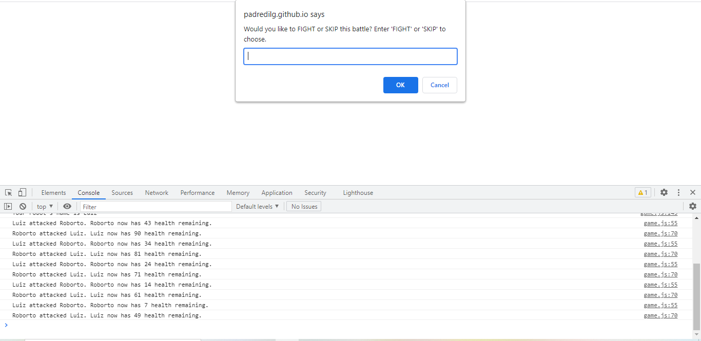

# Luiz Guilherme Padredi

# Robot Gladiators :pencil:

## :label: Description
Simple game in which the user's robot fights other robots in order to achieve the highest score. 
The game is played through a series of confirms and prompts, and the console found in the browser's Developer's tools.

## :scroll: Instructions
Choose a name for your robot and decide when your robot should fight, skip the fight, and spend money on the shop in between fights.  Try to reach the highest score!

## 	:hash: Coding Languages Used
:heavy_check_mark: HTML 
:heavy_check_mark: CSS 
:heavy_check_mark: JavaScript  
jQuery and Bootstrap were not used.

## :desktop_computer: Website
Link to Website: https://padredilg.github.io/robot-gladiators/
  
Screenshot from Website:

## :clap: Credits

:hammer_and_wrench: Created by Luiz Guilherme Padredi